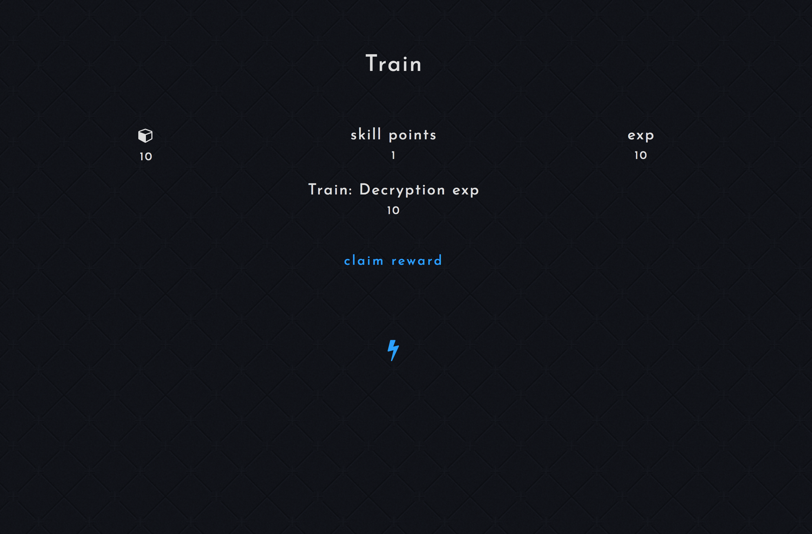

# Secret Republic - Alpha V4

See screenshots at the bottom. Audio trailer: https://www.youtube.com/watch?v=6thfiGb-b7c

The code for the Secret Republic hacker simulation role playing browser text game.

A lot of work has gone into this but it (and more in its previous version) is not a documented (as of yet) project.

It's been through years of development with this being its 3rd full do-over.

However, the project on stand-by so I've decided to make the source available of nothing else

Read more about the history of the game and the more complete older version in the works for open sourcing @ https://medium.com/@adrian.n/secret-republic-open-sourced-hacker-simulation-futuristic-rpg-browser-based-game-php-843d393cb9d7

# Main Features

1 Audio AI (woman, same as trailer) voice speaks when interacting with the game

2 Futuristic bootstrap based UI, mobile ready, made to feel like an app

3 Point and click based missions with servers of multiple types (file servers, email and database)

4 In-game Mission designer with BBCode like syntax features

5 Upgradable knowledge & skills

6 Rewards system

# SecretAlpha V3 ( MORE FEATURES! )

I probably recommend you try to run both versions or at least check out both repositories. V3 is much older, less organized or respecting any patterns what-so-ever code, mostly written from scratch but I've refactored some dependency management into it.

https://github.com/nenuadrian/Secret-Republic-Hacking-Browser-Game-V3

# Setting up

You need a webserver able to run PHP and an MySQL database (LAMP).

1. Install MAMP (https://www.mamp.info/en/) for windows or WAMP (http://www.wampserver.com/en/) for Mac to get them out of the box.

2. Import db.sql into a fresh MySQL db.

3. Copy fuel/app/config/config.template into fuel/app/config/db.php and add your DB details.

4. Copy fuel/app/config/db.template into fuel/app/config/config.php and configure it if you want.

5. Copy fuel/app/config/email.template into fuel/app/config/email.php and configure it if you want to setup email sending.

6. Run 'composer install' and 'composer update' (more optional info about composer: https://getcomposer.org/)

7. Create an account through the signup form and set your group to 2 in the database in order to become a Cardinal (admin).

# Cron jobs

You may want to setup tasks to run the following code once in a while

your-url/cron/rankings

your-url/cron/emails

e.g.

*/2 * * * * wget -O - http://localhost/cron/emails >/dev/null 2>&1

https://en.wikipedia.org/wiki/Cron

# Screenshots

## Skills

## Knowledge base

## Missions (there are email, database and file based servers which can be used to design different puzzles)

## Simple rankings

## Mission designer

## Rewards

## Edit account

# Travelling through time - V1

# Read about the journey

https://medium.com/@adrian.n/secret-republic-open-sourced-hacker-simulation-futuristic-rpg-browser-based-game-php-843d393cb9d7

# License

Please link and contribute back to this repository if using the code or assets :)
