# SecretAlpha - So long, and thanks for all the fish

See screenshots at the bottom.

The code for the Secret Republic hacker simulation role playing game.

Futuristic UI. Mission designer. Audio AI voice speaks when interacting with the game.

A lot of work has gone into this but it is not a documented (as of yet) project.

It's been through years of development with this being its 3rd full do-over.

However, the project on stand-by so I've decided to make the source available of nothing else

Read more about the history of the game and the more complete older version in the works for open sourcing @ https://medium.com/@adrian.n/secret-republic-open-sourced-hacker-simulation-futuristic-rpg-browser-based-game-php-843d393cb9d7

# Setting up

Configure an MySQL DB and import db.sql

Copy fuel/app/config/db.template into fuel/app/config/db.php

Copy fuel/app/config/config.template into fuel/app/config/db.php and configure it.

Run 'composer install'

Create an account and set your group to 2 in order to become a Cardinal (admin).

# License

Released under public common MIT license. Please credit and contribute back!

# Screenshots

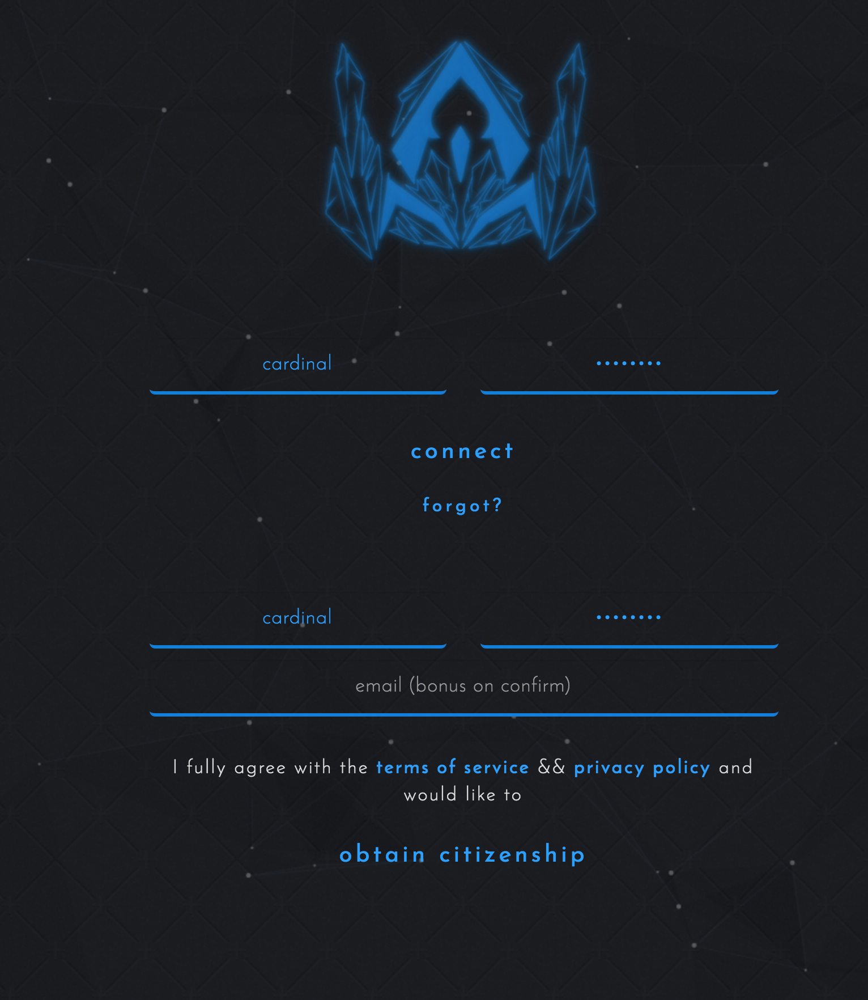

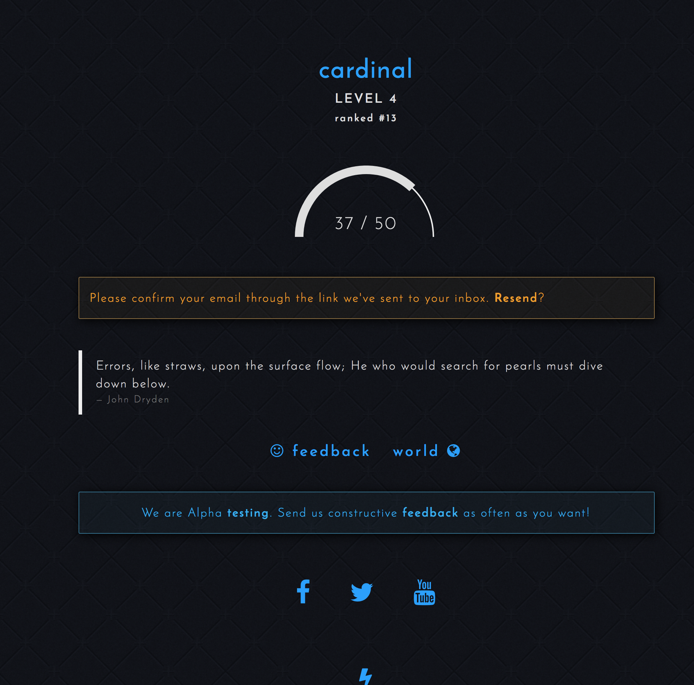

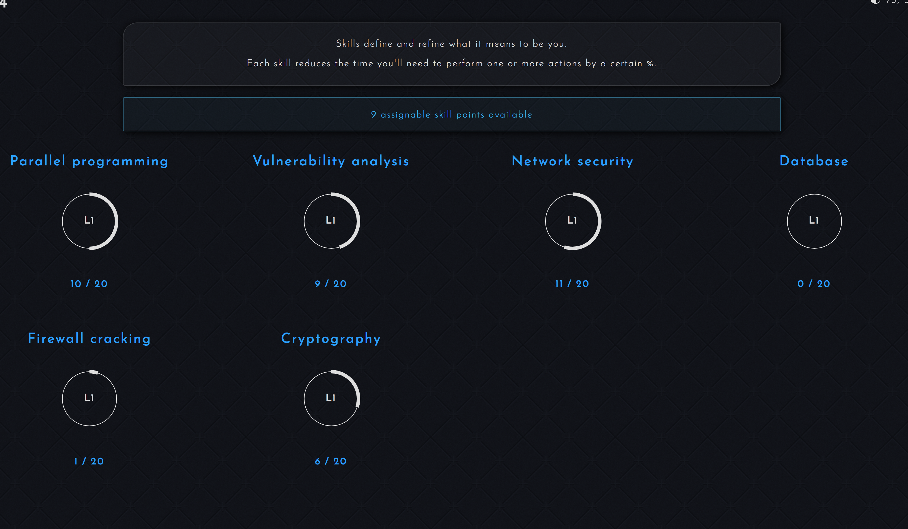

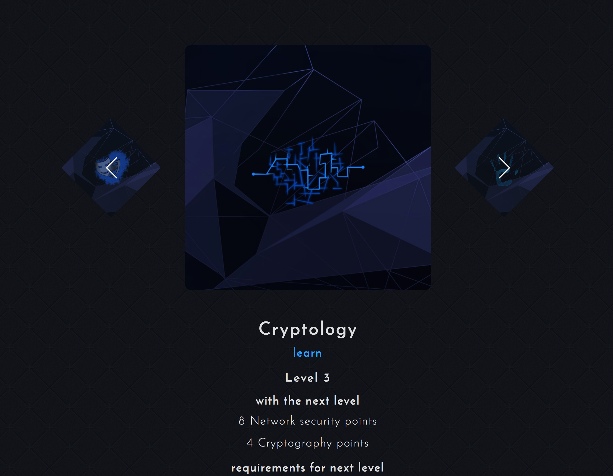

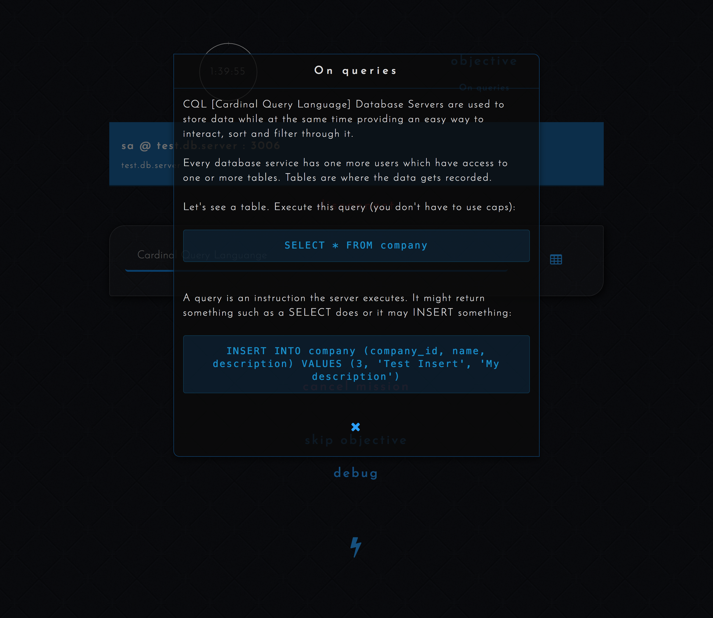

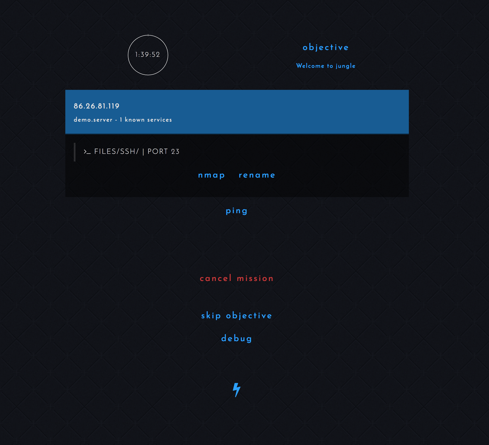

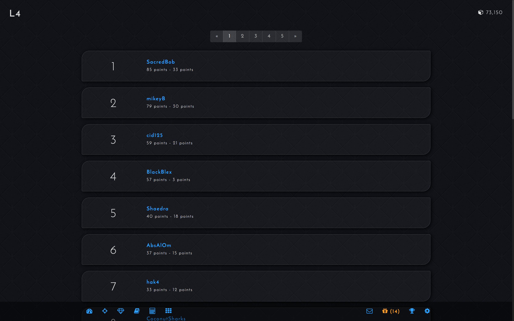

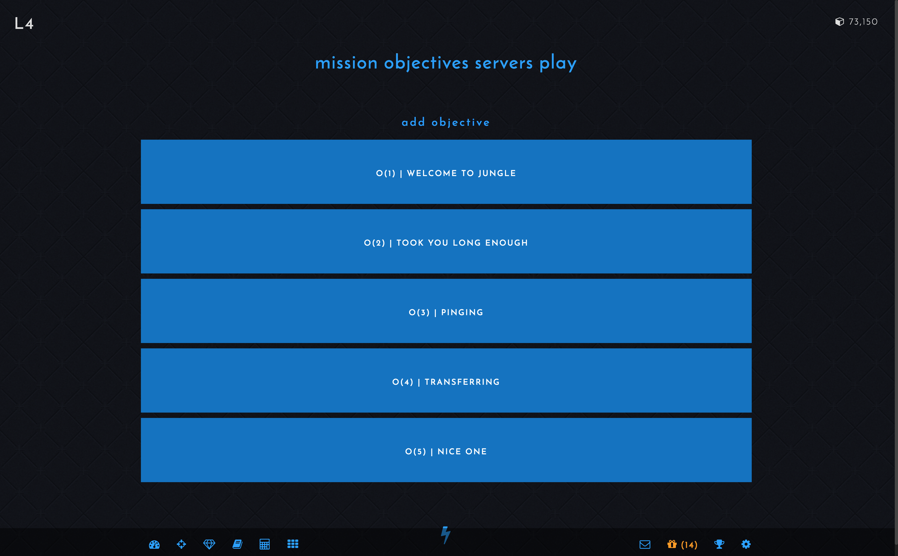

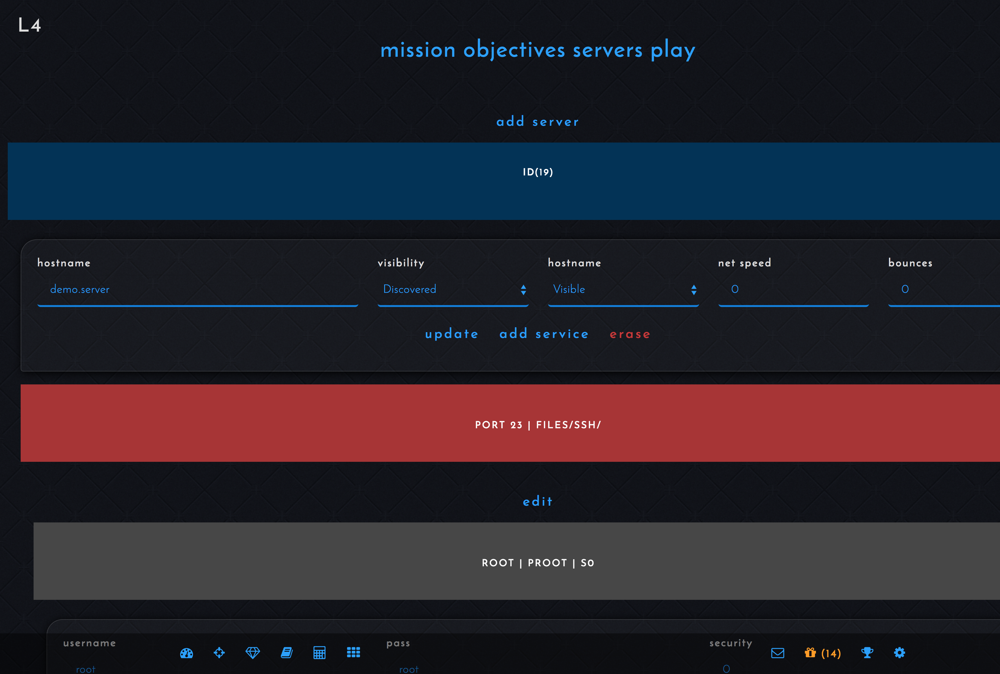

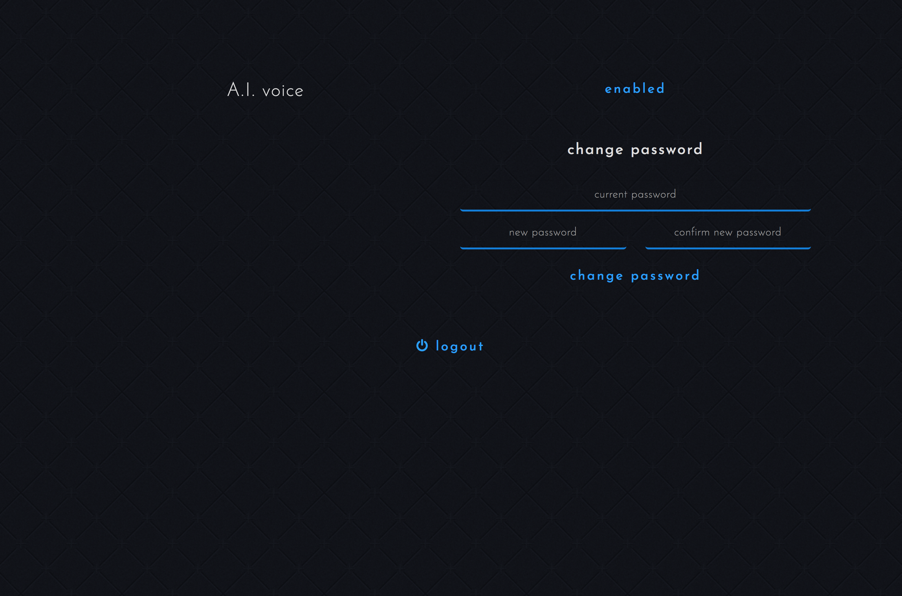

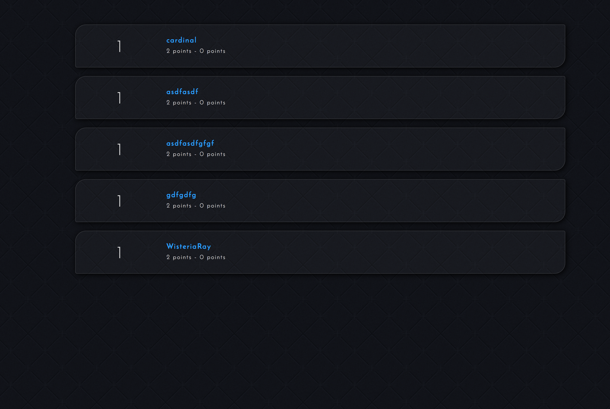

# Travelling through time

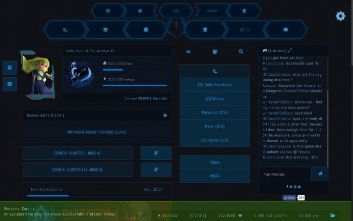

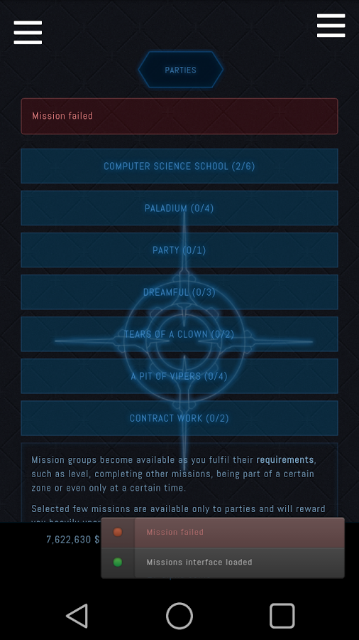

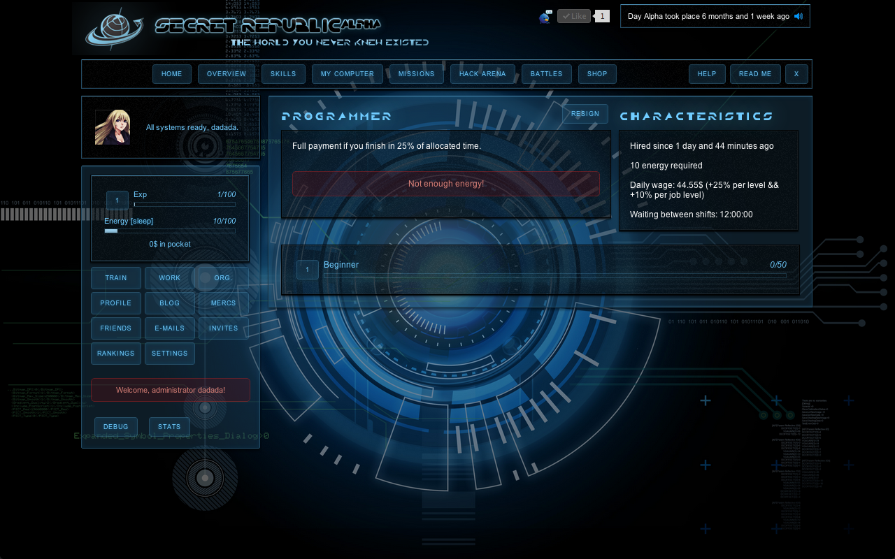
